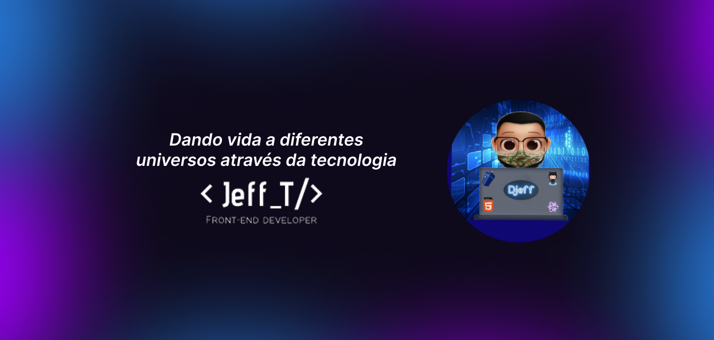
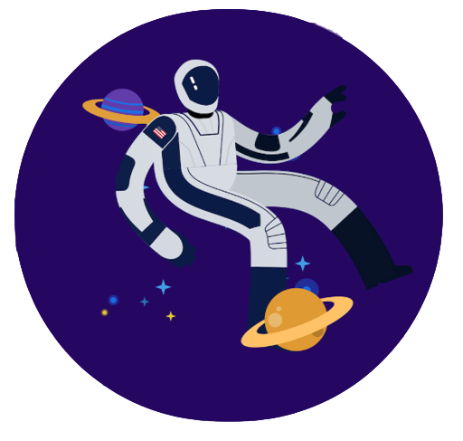

<h1 align="center">👨‍💻 Olá, Mundo!☕</h1>

 🖖<strong>Meu nome é Jeferson Tavares. Sou quase um cientista da computação, estagiário na Compass.uol como Dev Front-end e gamer nas horas vagas</strong>

---

  
  
"<em>Como um astronauta minha mente vaga pela infinitude do espaço, dando vida aos diferentes mundos que antes eram apenas ideias, criando as coisas mais loucas que se pode imaginar, dando visibilidade, notoriedade e ligando os olofotes para ue o público possa apreciar. Pintar o espaço fazendo do código meu pincel e flutuar pela imensidão das possibilidades</em>"

---

## 🚀 Minhas Skills

<code></code>
<code></code>
<code></code>
<code></code>
<code></code>

## 💼 Ferramentas

<code></code>
<code></code>
<code>!</code>
<code></code>
<code></code>
<code></code>

----

## ⭐ Informações sobre minha conta GitHub

  

  

  

###

## 💬 Entre em contato

  
  
  
  

---

